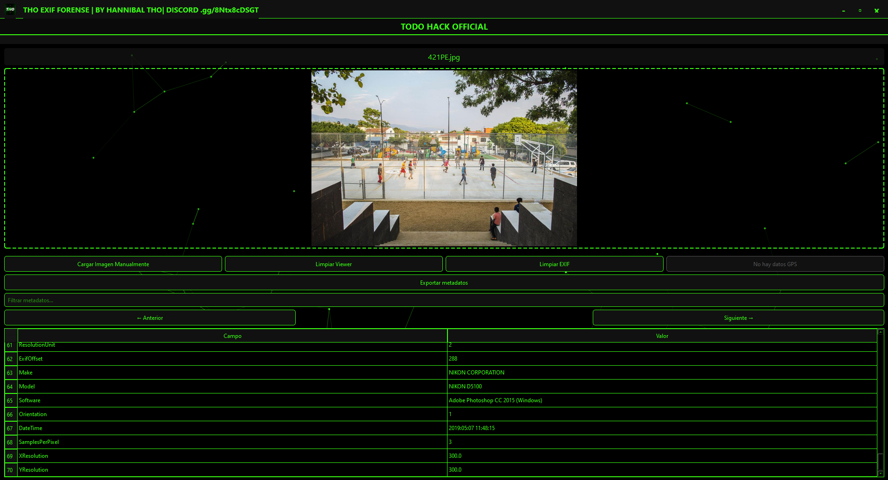

<p align="center">
  
</p>

# THO EXIF FORENSE | ANALISIS FORENSE


> **Herramienta Profesional de Análisis Forense de Metadatos EXIF con Interfaz de Estilo Hacker**

**THO EXIF FORENSE** es una potente herramienta de análisis forense digital diseñada para examinar, extraer y gestionar metadatos EXIF de imágenes. Desarrollada con Python y PySide6, ofrece una interfaz moderna con temática oscura y acentos verdes, inspirada en el estilo hacker, ideal para análisis forense y auditorías de privacidad.

## 🚀 Características Principales

- 🖥️ **Interfaz de Estilo Hacker** - Tema oscuro con acentos verdes para una visualización óptima durante largas sesiones de análisis
- 📂 **Soporte de Arrastrar y Soltar** - Carga imágenes fácilmente arrastrándolas a la aplicación
- 🔍 **Análisis EXIF Completo** - Visualiza todos los metadatos incrustados en una tabla organizada
- 🗺️ **Extracción de Ubicación GPS** - Detecta automáticamente coordenadas y muestra la ubicación en el mapa
- 🛠️ **Exportación de Metadatos** - Guarda los metadatos en múltiples formatos para su posterior análisis
- 🖼️ **Vista Previa de Imágenes** - Visualización rápida de la imagen analizada
- 🔄 **Navegación entre Múltiples Imágenes** - Cambia fácilmente entre varias imágenes cargadas
- 🕵️ **Búsqueda y Filtrado** - Encuentra rápidamente entradas específicas de metadatos
- 🚫 **Limpieza de EXIF** - Elimina metadatos sensibles antes de compartir imágenes
- 📱 **Integración con la Bandeja del Sistema** - Minimiza a la bandeja del sistema para un acceso rápido
- 🌐 **Soporte Multiformato** - Compatible con los formatos de imagen más comunes

## 📋 Formatos de Imagen Soportados

| Formato | Descripción |
|---------|-------------|
| JPG/JPEG | Formato estándar de cámaras digitales |
| PNG | Gráficos de Red Portátiles |
| TIFF | Formato de Archivo de Imagen Etiquetada |
| BMP | Mapa de Bits |
| WEBP | Formato de Imagen Web |
| GIF | Formato de Intercambio de Gráficos |
| HEIC | Formato de Imagen de Alta Eficiencia (iOS 11+) |

## 🛠️ Instalación

### Requisitos Previos
- Python 3.7 o superior
- pip (gestor de paquetes de Python)

### Configuración

1. **Clona el repositorio**
   ```bash
   git clone https://github.com/HANNIBAL-THO/THO-EXIF-FORENSE
   cd THO-EXIF-FORENSE
   ```

2. **Instala las dependencias**
   ```bash
   pip install -r requirements.txt
   ```

3. **Ejecuta la aplicación**
   ```bash
   python start.py
   ```
## 🎥 Video tutorila de uso

- https://youtu.be/drmK3zEACRo
   
### 🧼 Platforms that Remove EXIF Metadata

| Platform            | Removes EXIF? | Important Notes                                                                |
|---------------------|----------------|----------------------------------------------------------------------------------|
| **WhatsApp**        | ✅ Yes         | Compresses and removes all EXIF including location.                             |
| **Instagram**       | ✅ Yes         | Removes metadata for both posts and stories.                                   |
| **Facebook**        | ✅ Yes         | Removes EXIF publicly; retains it internally for analysis.                      |
| **Twitter (X)**     | ✅ Yes         | Removes metadata (allowed partial EXIF until 2020 for JPG).                     |
| **Telegram**        | 🚫 No          | Keeps EXIF when sent as file; removes when sent as compressed image.           |
| **Google Photos**   | ✅ Partial     | Removes some EXIF on shared links but keeps it in your private account.         |
| **iCloud**          | 🚫 No          | Retains full EXIF when uploading from Apple devices.                            |
| **Discord**         | ✅ Yes         | Removes metadata from previews; sometimes keeps it in file downloads.           |
| **LinkedIn**        | ✅ Yes         | Strips metadata from profile and post images.                                   |
| **TikTok**          | ✅ Yes         | Thumbnails and exported content are EXIF-clean.                                 |
| **Reddit**          | ✅ Yes         | Removes all EXIF from uploaded images.                                          |
| **WeTransfer**      | 🚫 No          | Transfers files exactly as-is, with all metadata intact.                        |

---

## 🖥️ Cómo Usar la Herramienta

### 1. Análisis Básico de Imágenes
1. **Carga una imagen** usando el botón "Abrir Imagen" o arrastrándola a la ventana
2. **Explora los metadatos** en la tabla desplegada
3. **Usa la barra de búsqueda** para encontrar metadatos específicos rápidamente

### 2. Trabajo con Ubicaciones GPS
- Las coordenadas GPS detectadas se mostrarán automáticamente
- Haz clic en el botón del mapa para ver la ubicación en tu navegador web predeterminado
- Exporta las coordenadas para su uso en otras herramientas de mapeo

### 3. Gestión de Múltiples Imágenes
- Navega entre varias imágenes cargadas usando los controles de navegación
- Compara metadatos entre diferentes imágenes
- Exporta los resultados de múltiples análisis simultáneamente

### 4. Exportación de Datos
- Exporta metadatos a formatos estándar (JSON, TXT)
- Genera informes personalizados para presentaciones forenses
- Copia datos específicos al portapapeles para compartirlos fácilmente

## 🔍 Casos de Uso Típicos

### Análisis Forense Digital
- Investigación de procedencia de imágenes
- Verificación de autenticidad de fotografías
- Análisis de metadatos en investigaciones legales

### Auditoría de Privacidad
- Identificación de fugas de información personal
- Verificación de limpieza de metadatos antes de compartir
- Educación sobre privacidad digital

### Desarrollo e Investigación
- Depuración de aplicaciones que manejan imágenes
- Investigación de patrones en metadatos
- Automatización de procesos de análisis

## 📸 Capturas de Pantalla

*Se agregarán capturas de ejemplos*

## 📄 Licencia

Este proyecto está bajo la Licencia MIT - consulta el archivo [LICENSE](LICENSE) para más detalles.

## ⚠️ Aviso Legal

Esta herramienta está diseñada únicamente para análisis forense legal y fines educativos. Los desarrolladores no se hacen responsables del mal uso de este software. El uso de esta herramienta para acceder a información sin autorización es ilegal y está estrictamente prohibido.
